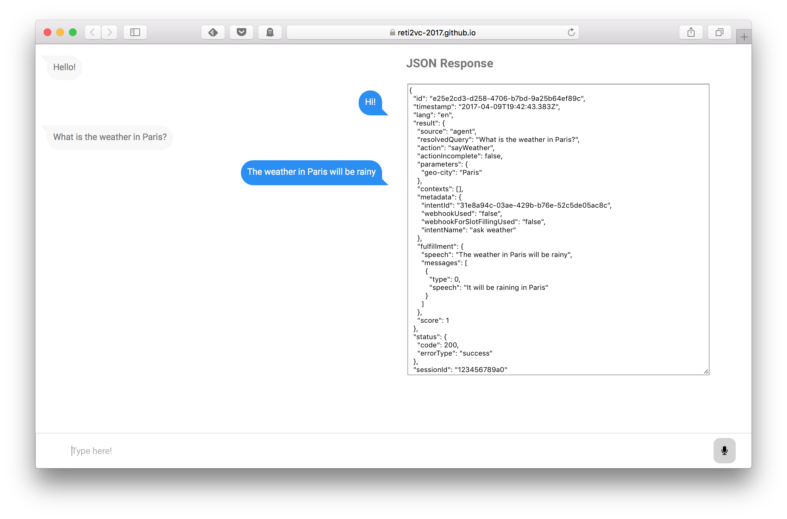

# Dialogflow weather sample

This repository is an example, developed in classroom, for getting started with [Dialogflow](https://dialogflow.com).

The repository contains a simple agent to speak about the weather (`WeatherAgent.zip`), to be imported in _Dialogflow_.

Moreover, it contains an example of how to interact with the _Dialogflow_ API (v1) through HTML5 and JavaScript. It uses the HTML5 [Web Speech API](https://developer.mozilla.org/en-US/docs/Web/API/Web_Speech_API) to providing both speech-to-text and text-to-speech functionality in the browser. It was tested on Chrome 57+ and Safari 10.1+.

The JavaScript code present in the example has been inspired by the [gist](https://gist.github.com/Gugic/cfc008599fa9a82eeba4127648009132) provided in the [Dialogflow documentation](https://dialogflow.com/docs).

## Try it!

The example contained in this repository is published at https://reti2vc-2018.github.io/dialogflow-weather/
